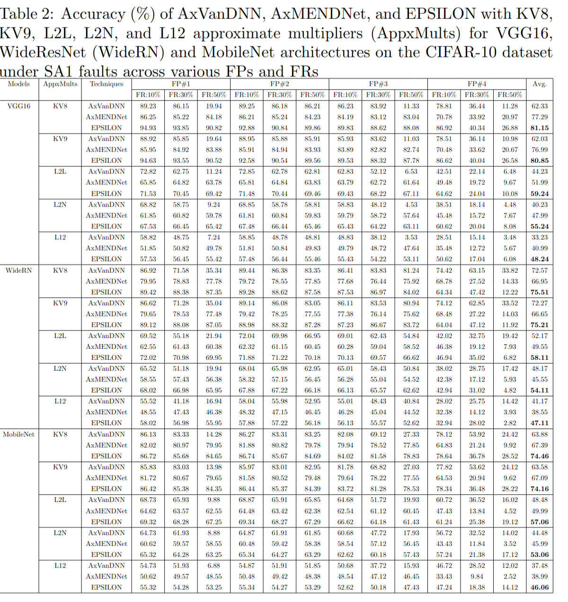
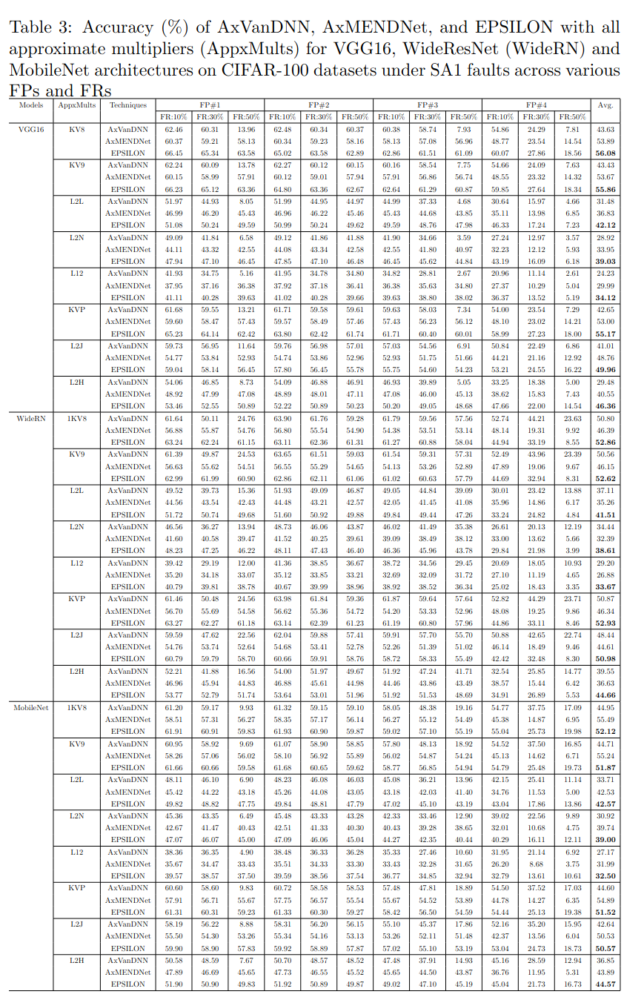
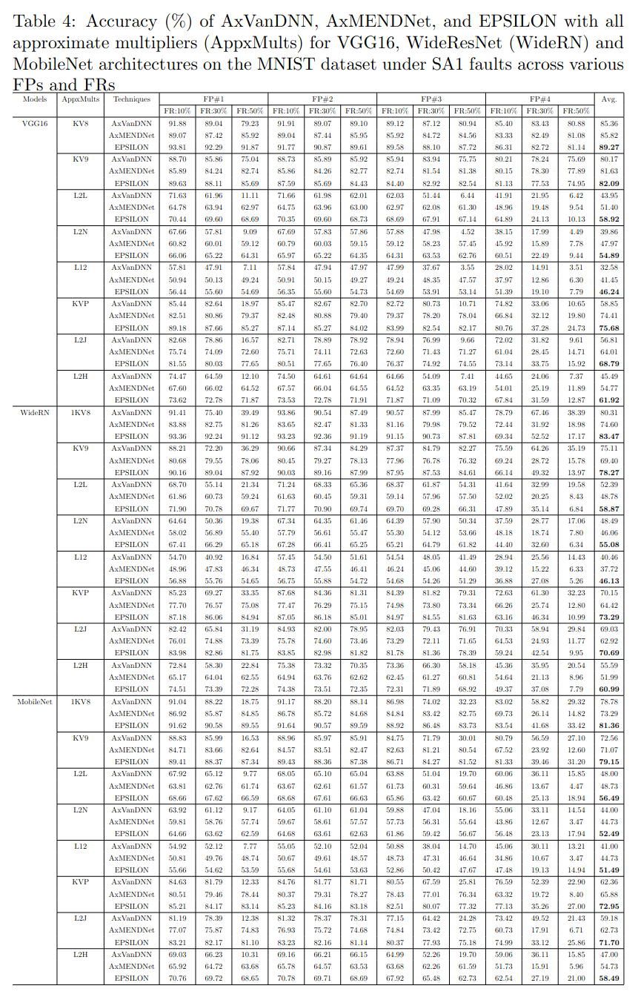
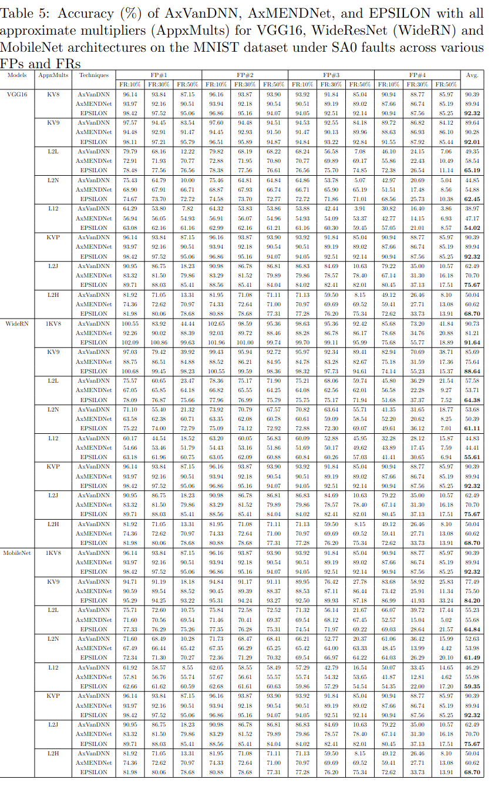
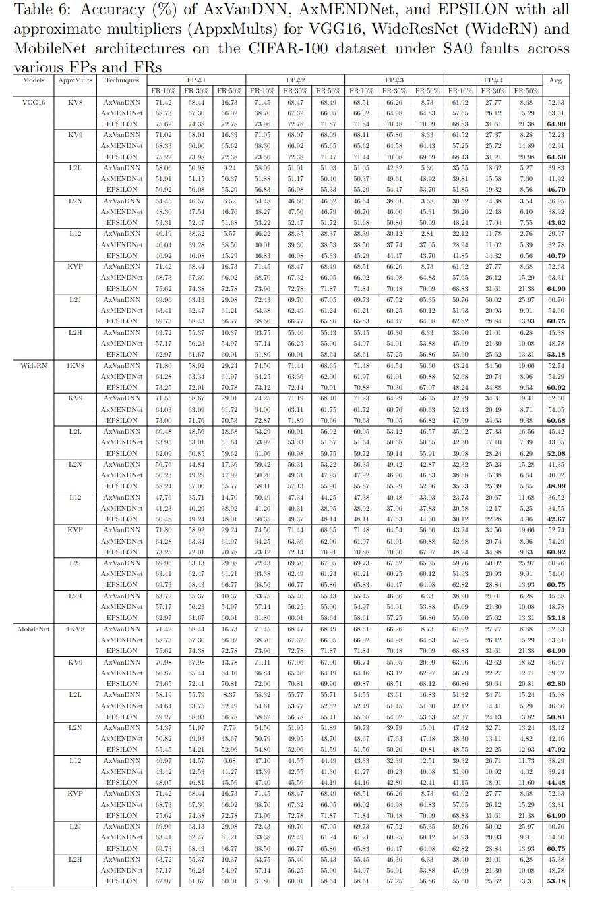
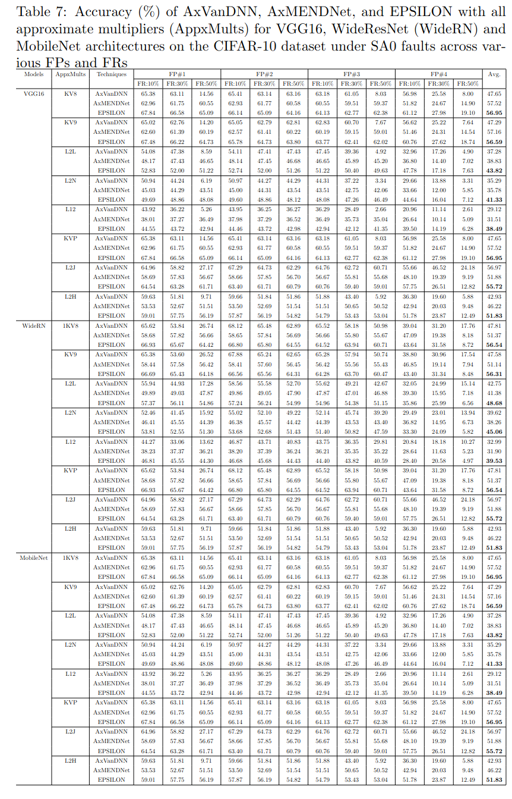
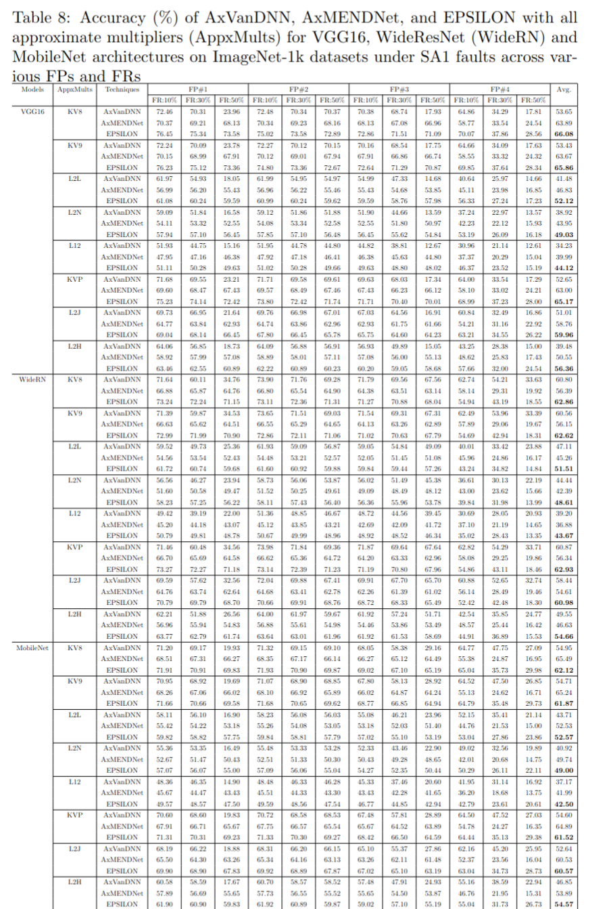
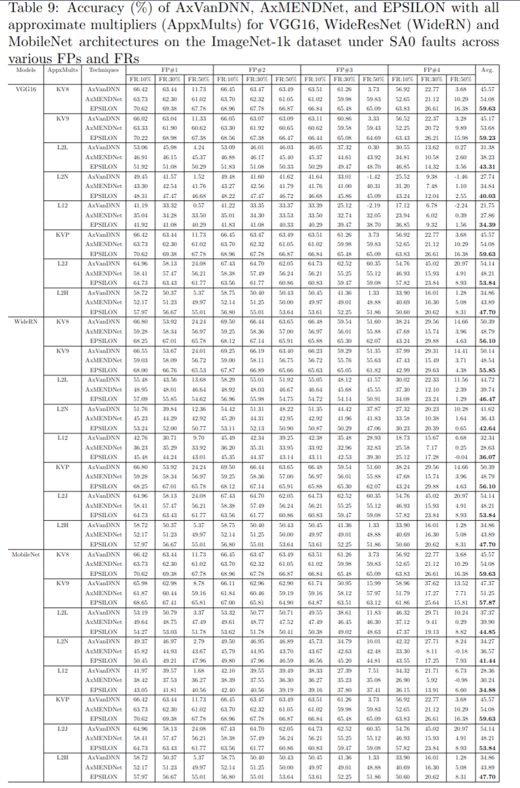
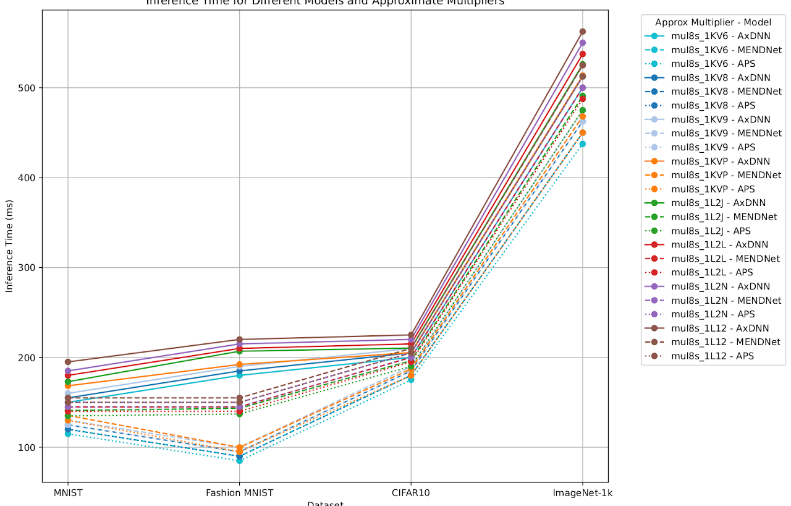
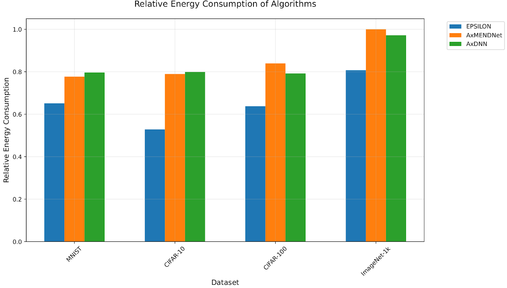

# EPSILON: Adaptive Fault Mitigation in Approximate Deep Neural Network using Statistical Signatures

This repository contains the **results and figures** corresponding to the paper:

**Title**: *EPSILON: Adaptive Fault Mitigation in Approximate Deep Neural Network using Statistical Signatures*  
**Authors**: Khurram Khalil, Khaza Anuarul Hoque  
**Affiliation**: Department of Electrical Engineering and Computer Science, University of Missouri-Columbia, USA  
**Contact**: hoquek@missouri.edu

---

## 📄 Abstract

The increasing adoption of approximate computing in deep neural network accelerators (AxDNNs) promises significant energy efficiency gains. However, permanent faults in AxDNNs can severely degrade their performance compared to their accurate counterparts (AccDNNs). Traditional fault detection and mitigation approaches, while effective for AccDNNs, introduce substantial overhead and latency, making them impractical for energy-constrained real-time deployment.

To address this, we introduce **EPSILON**, a lightweight framework that leverages pre-computed statistical signatures and layer-wise importance metrics for efficient fault detection and mitigation in AxDNNs. Our framework introduces a novel non-parametric pattern-matching algorithm that enables constant-time fault detection without interrupting normal execution while dynamically adapting to different network architectures and fault patterns.

EPSILON maintains model accuracy by intelligently adjusting mitigation strategies based on a statistical analysis of weight distribution and layer criticality while preserving the energy benefits of approximate computing. Extensive evaluations across various approximate multipliers, AxDNN architectures, popular datasets (MNIST, CIFAR-10, CIFAR-100, ImageNet-1k), and fault scenarios demonstrate that EPSILON maintains **80.05% accuracy** while offering **22% improvement in inference time** and **28% improvement in energy efficiency**, establishing EPSILON as a practical solution for deploying reliable AxDNNs in safety-critical edge applications.

---

**Keywords**: Approximate Computing, Deep Neural Networks, Fault Tolerance, Energy Efficiency, Fault Detection

---

## 📊 Results & Figures

The following images are figures from the experiments and evaluations conducted in the EPSILON study:

### 🔹 Figure 1

### 🔹 Figure 2

### 🔹 Figure 3

### 🔹 Figure 4

### 🔹 Figure 5

### 🔹 Figure 6

### 🔹 Figure 7

### 🔹 Figure 7

### 🔹 Figure 7

### 🔹 Figure 7

## 🧠 Citation

If you find this work useful in your research, please cite our paper (citation info to be added upon publication).

---

## 🔗 License

This repository is for academic and research use only.

---
